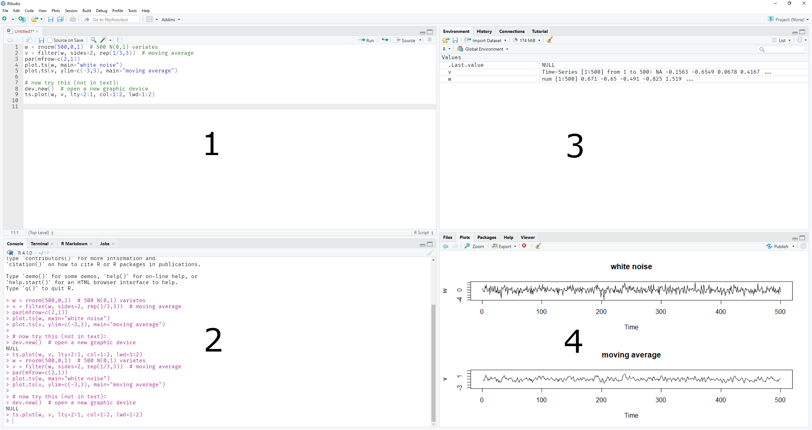
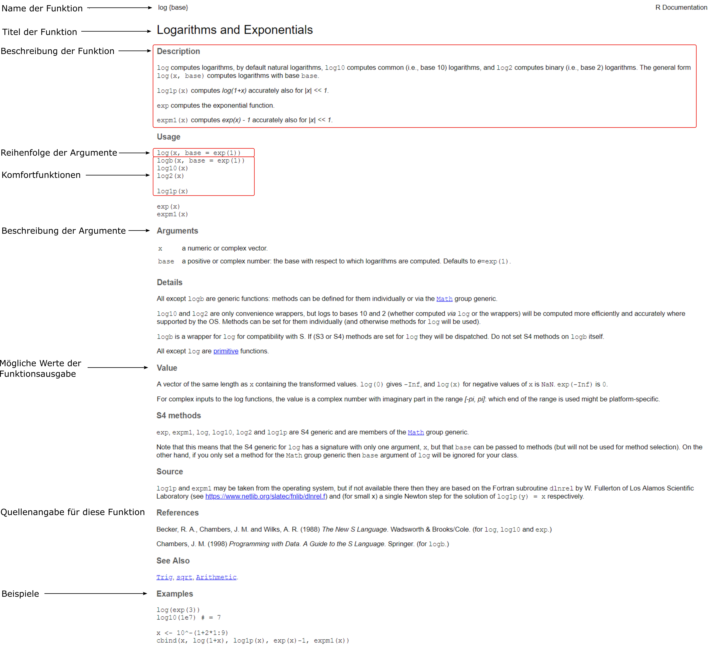
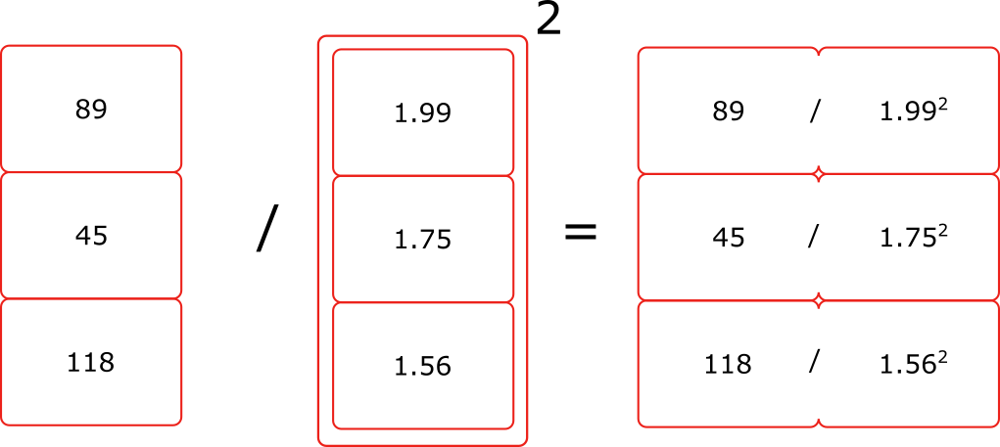

---
output:
  bookdown::pdf_document2:
    pandoc_args: "_common/header.yaml"
    includes:
      in_header: 
        - _tex/preamble.tex
header-includes:
  - \chead{Einführung in R}
---

```{r, echo=F}
library(knitr)
opts_chunk$set(fig.width = 5, fig.height = 3.8, fig.align = "center", 
               comment = NA, strip.white = TRUE, 
               out.width = ".8\\textwidth",
               warning = FALSE, message = FALSE, 
               background = "springgreen3")
#knit_theme$set(knit_theme$get()[9])
options(digits = 7)
```

# R und RStudio

R ist eine Programmiersprache und wird meist für das Aufbereiten und Analysieren von statistischen Daten in der Wissenschaft und Wirtschaft eingesetzt. Man kann beispielsweise komplizierte Rechnungen durchführen oder auch Grafiken für die Veranschaulichung von Daten zeichnen. R wird regelmäßig durch Updates und Pakete verbessert und erweitert. Einer der wesentlichen Vorteile von R ist, dass es kostenlos erhältlich und quelloffen (*open source*, Programmcode ist für alle einsehbar) ist. Nicht nur deshalb hat sich um R ein großes Ökosystem aufgebaut, welches eine Vielzahl an Lernressourcen bietet, die einen einfachen Einstieg in die statistische Auswertung von Daten bietet. 

Im Vergleich zu statistischen Softwarepaketen wie beispielsweise SPSS, Minitab oder SAS kann R erst einmal abschreckend wirken, da ein benutzerfreundliches *User Interface* fehlt.  Mithilfe RStudios, einer sogenannten integrierten Entwicklungsumgebung, wird die Arbeit mit R aber leichter und zugänglicher. R ist also für die Berechnungen, Visualisierungen etc. zuständig, während RStudio es uns leichter macht, genannte Berechnungen und Visualisierungen durchzuführen oder darzustellen.

## Installation von R und RStudio

1.  Um RStudio nutzen zu können, muss R installiert sein. Laden Sie daher die aktuelle R-Version herunter und installieren Sie diese: [R-Project](https://cran.r-project.org/)
2.  Nun können Sie RStudio herunterladen und installieren: [RStudio](https://rstudio.com/products/rstudio/download/#download)
3.  Starten Sie RStudio

Falls Probleme beim Installationsprozess aufkommen sollten, können Sie die Installationstutorials auf Moodle nutzen. Dort finden Sie Installationsvideos für Windows und MacOS sowie Links zu Hilfestellungen in Textform. 

## RStudio

Nach dem RStudio gestartet wurde, sollten Sie nun die in Abbildung \ref{layout} dargestellte Benutzeroberfläche sehen können. Im Augenblick besteht RStudio aus insgesamt vier Fenstern:

1.  **Editor**: Hier können Funktionen und Programme geschrieben und abgespeichert werden.
2.  **Console**: Hier können einzelne Befehle ausgeführt werden und hier erscheint potentiell der *Output* der aufgerufenen Befehle. 
3.  **Environment**: Hier werden sogenannte Objekte angezeigt, welche in R definiert oder aufgerufen wurden (z.B. geladene Datensätze). 
4.  **Files/Plots/Packages/Help**: Hier wird derzeit eine Grafik angezeigt.



Um nicht ständig Befehle erneut eingeben zu müssen, wird ein Skript verwendet, um Befehle abzuspeichern und so zu einem späteren Zeitpunkt ausführen zu können. Dieses wird im Editor bearbeitet.  
Das Skript ist eine einfache Textdatei, die Befehle und Kommentare enthält. Die Dateiendung ist .R -- also der Dateiname z. B. `MeinSkript.R` --, damit die Datei von R erkannt wird.  
Geöffnet in R oder RStudio können die einzelnen Befehle durch den Benutzer ausgeführt werden. Das allgemeine Vorgehen lässt sich in folgenden Schritten beschreiben:

1. Erstellen eines neuen Skripts. (s. Abbildung \ref{fig:new_script})
    + Klick auf das rot markierte Icon, um ein neues R Skript zu erstellen
2. Schreiben von Befehlen in das Skript. (s. Abbildung \ref{fig:editor})
    + Im *Editor* kann neuer Code geschrieben, editiert und gespeichert werden
3. Ausführen eines Befehls (in dessen Zeile der Cursor gerade blinkt) oder mehrerer (aktivierter) Befehle.
    + Klick auf Icon *Run* in der Navigationsleiste des Skripts (s. Abbildung \ref{fig:runcode}) ODER 
    + Tastenkombination \keys{\ctrl} + \keys{\return} (Windows, auf deutschen Tastaturen Strg statt ctrl) bzw. 
    + Tastenkombination \keys{\cmd} + \keys{\return} (MacOS)
    + Es wird immer der markierte Code ausgeführt, d.h., in der Zeile, in welcher der Zeiger blinkt, wird der Code ausgeführt. Wenn mehrere Zeilen markiert wurden, wird der gesamte Block von markierten Zeilen hintereinander ausgeführt.
    + Der markierte Code erscheint nach dem Ausführen im *Console*-Fenster.
4. Befehl wird dadurch von R \textcolor{blue}{blau} in die Console geschrieben
    + Ergebnis erscheint schwarz in der Console und/oder eine \textcolor{red}{Warn-} oder \textcolor{red}{Fehlermeldung} (in rot).
    + Warnmeldungen erfordern nicht unbedingt eine Reaktion, aber sollten trotzdem gelesen werden (eventuell wichtig). 
    + Bei Fehlermeldungen konnte der Befehl nicht (vollständig) ausgeführt werden. Die Fehlermeldungen helfen einem zu erkennen, **wo** der Fehler aufgetreten ist (manchmal sogar, *warum*).
5. Speichern von Skript, Daten, Ergebnissen
    + \menu{File > Save} oder per Tastenkombination \keys{\ctrl} + \keys{s}.
    
 \begin{figure*}
        \centering
        \begin{subfigure}[b]{0.475\textwidth}
            \centering
            \includegraphics[width=\textwidth]{img/new_script_final.png}
            \caption[]%
            {{\small Erstellen eines neuen Skripts in RStudio}}
            \label{fig:new_script}
        \end{subfigure}
        \hfill
        \begin{subfigure}[b]{0.475\textwidth}  
            \centering 
            \includegraphics[width=\textwidth]{img/editor.png}
            \caption[]%
            {{\small Der Editor zeigt das Skript, in welchem der Code bearbeitet werden kann}}    
            \label{fig:editor}
        \end{subfigure}
        \vskip\baselineskip
        \begin{subfigure}[b]{0.95\textwidth}   
            \centering 
            \includegraphics[width=\textwidth]{img/runcode.png}
            \caption[]%
            {{\small Ausführen von R Code}}    
            \label{fig:runcode}
        \end{subfigure}
        \caption[]
        {\small Erstellen, Bearbeiten und Ausführen von Skripten in RStudio} 
        \label{fig:bigfigure}
    \end{figure*}

# R Basics

## Mathematische Operatoren

R kennt eine Reihe von arithmetischen Operatoren. 

```{r}
13+2               
5-7               
5*2               
4/2                
3^2       
```

Komplexere Berechnungen verhalten sich nach denselben Regeln, die Sie aus dem Mathematikunterricht kennen:

```{r}
((13*2)-3^5)/22
```

## Kommentare

Wenn man sein R Skript mit anderen Personen teilen möchte oder vielleicht erst einige Zeit später das R-Skript bearbeitet, kann es sinnvoll sein, die Zeilen im R-Skript zu kommentieren. Kommentare dienen dazu, Teile eines Skripts zu erklären bzw. nachvollziehbarer zu machen. In R wird ein Kommentar mit dem Rautesymbol `#` erstellt. Alles was in der gleichen Zeile auf die Raute folgt, wird von R nicht ausgewertet. 

Beispiel:
```{r}
13+2    # Addition     
5-7     # Subtraktion
5*2     # Multiplikation          
4/2     # Division            
3^2     # Potenzrechnung
```

## Logische Abfragen 

R kennt auch Logik und kann mit den entsprechenden logischen (oder *relationalen*) Operatoren entscheiden, ob eine Aussage wahr (`TRUE`) oder falsch (`FALSE`) ist. 

Symbol | Bedeutung | Beispiel | Ergebnis
-------|-----------|----------|---------
`==`   | gleich| `3 == 4` | `FALSE`
`!=`   | ungleich | `3 != 4` | `TRUE`
`>`    | größer als | `3 > 4` | `FALSE`
`<`    | kleiner als | `3 < 4` | `TRUE`
`>=`   | größer gleich | `3 >= 4` | `FALSE`
`<=`   | kleiner gleich | `3 <= 4` | `TRUE`
`&`    | UND | `3 < 4 & 3 == 4` | `FALSE`
`|`    | ODER | `3 < 4 | 3 == 4` | `TRUE`
`!`    | NICHT | `!FALSE` | `TRUE`
  
  - Den Bedingungsstrich $\mid$  erhält man über \keys{\AltGr + <} bzw. \keys{\Alt + 7} (MacOS)
  - Diese Befehle werden uns in späteren Sitzungen zum Filtern nützlich sein. Beispielsweise könnten wir dem Programm so mitteilen, dass wir nur Personen angezeigt haben möchten, die jünger als 20 Jahre alt sind (für die also gilt, dass die Bedingung `age < 20` wahr ist).
  - Weitere hilfreiche Eigenschaften der logischen Werte: 
    1. Sie lassen sich abkürzen mit `T` und `F` (Großschreibung beachten!).
    2. Sie entsprechen den Werten 1 und 0 und lassen sich daher zählen. Beispielweise ergibt 

```{r}
TRUE + FALSE + TRUE
```

## Funktionen

Funktionen sind oftmals kleine Programme (Unterprogramme), die mit einem Befehl aufgerufen werden können, um eine bestimmte Aufgabe auszuführen. 

Ein Beispiel für eine Funktion, die Sie von Ihrem gewöhnlichen Taschenrechner kennen:

```{r}
sqrt(3.1415)          # Quadratwurzel
abs(-1.6180)          # Absolutwert
exp(2)                # Eulersche Zahl / e-Funktion
```

### Argumente
Funktionen können Argumente entgegennehmen, mit der wir die Verhaltensweise der Funktion verändern können. Diese Argumente werden der Funktion übergeben. Bei mehreren Argumenten werden diese durch Kommata getrennt:

\begin{center}
    \texttt{funktion(argument1 = wert1, argument2 = wert2, ...)}
\end{center}

Für den Logarithmus kann man beispielsweise die Basis angeben:  
```{r}
log(x = 4, base = 2)
```
  - Hier entspricht `log` der gewünschten Funktion
  - `x` ist das erste Argument, welchem wir den Wert `4` übergeben. Es entspricht der Zahl, die wir logarithmieren wollen 
  - `base` ist das zweite Argument, welchem wir den Wert `2` übergeben. Es entspricht der Basis des Logarithmus

Man kann Funktionen auch verschachteln, d.h. man kann einer Funktion das Resultat einer anderen Funktion übergeben.

\begin{center}
    \texttt{funktion1(argument1 = funktion2(...), argument2 = wert2, ...)}
\end{center}

Ein Beispiel:
```{r}
round(sum(1.16, 2.44, 3.83), digits = 1)
```

  - Hier wurde zuerst die Summe aus drei Zahlen berechnet, um anschließend das Ergebnis dieser Summe auf eine Dezimalstelle zu runden. **Geschachtelte Funktionen werden immer von innen nach außen ausgeführt** (d. h. die innere zuerst).
  - **Achtung**: In R ist das Dezimalzeichen der Punkt und das Trennzeichen das Komma. Dem `sum`-Befehl werden daher drei Zahlen übergeben: (1.16, 2.44, 3.83)
  
Vorteile bei der Nutzung von Funktionen:
  
  - Funktionen sind kurz und wiederverwendbar, was in übersichtlicheren Skripts resultiert
    + mehr Übersicht = Fehlererkennung einfacher
  - Funktionen erlauben die Nutzung von komplexen (statistischen) Verfahren ohne jedes technische Detail verstanden haben zu müssen

## Hilfe!

  - Falls Funktionen Argumente haben, findet man deren Namen über die **Hilfe** heraus. Die Hilfe erhält man entweder 
    + über das Menü \menu{Help > R Help} oder
    + direkt im rechten unteren Bereich von RStudio in der Karteikarte \menu{Help} oder
    + über Eintippen und Ausführen von `help(funktion)` oder `?funktion`, bspw.
    
```{r, eval=F}
?log
```

  - Nach dem Ausführen dieses Befehls erscheint ein Fenster mit einer ausführlichen Beschreibung der Funktion `log()` und all Ihrer Argumente. Machen Sie sich keine Sorgen, wenn Sie anfangs Schwierigkeiten haben sollten, den Inhalt der Hilfeseiten zu lesen. Die Hilfeseiten sind oftmals in einem sehr technischem Jargon geschrieben; es braucht daher Zeit und Übung, um diese zu verstehen. Im Augenblick genügt es die *Usage* und *Arguments* Abschnitte zu betrachten (s. Abbildung \ref{helppage}).



  - Wir sehen, dass `log()` zwei Argumente besitzt, und zwar `x` ("a numeric vector") und `base` ("a ... number: the base with respect to which logarithms are computed"). Macht es einen Unterschied, wenn man die Namen der Argumente übergibt oder nicht?
  
```{r}
log(x = 4, base = 2)
log(4, 2)
```

  - Nein! Falls man die Argumente **in der richtigen Reihenfolge** (wie sie in der Hilfe steht) angibt, muss man sie nicht unbedingt benennen. Wir werden das im Seminar aber fast immer machen.
  - Außerdem sehen wir, dass es für das `base` Argument eine Standardeinstellung (**default**) gibt, nämlich `base = exp(1)`, die Eulersche Zahl *e*, so dass ohne Änderung des `base` Arguments der natürliche Logarithmus $ln$ berechnet wird.
  - **Falls wir keine Einstellung eines Arguments vornehmen, wird die Standardeinstellung verwendet!**
  - Hat ein notwendiges Argument keine Standardeinstellung und wird nicht mit Werten bedient, erscheint eine Fehlermeldung: 

```{r, eval=F}
log()
```

\textcolor{red}{\texttt{Fehler: Argument "x" fehlt (ohne Standardwert)}}

  - Argumente können statt Zahlen auch logische Angaben benötigen (`T` oder `F`). Das ist dann ein An- oder Ausschalten von Optionen. 

## Vektoren

In der Psychologie enthalten Variablen meist keinen Einzelwert, sondern Werte von vielen Personen auf einmal – z. B. hier von dreien:

```{r}
c(100, 110, 97)         # IQ von drei Personen
c(89, 45, 118)          # Gewicht von denselben drei Personen !
c(1.99, 1.75, 1.56)     # Groesse von denselben drei Personen !
```

Das `c()` (für *combine*) ist eine einfache R-Funktion, die aus vielen Einzelwerten (mit Kommata getrennt) einen sogenannten Vektor bildet – also genau die Art von Daten, die man sich in der Psychologie meist vorstellt (Werte von vielen Personen bezüglich derselben Eigenschaft, Antworten vieler Personen auf dieselbe Frage oder Aufgabe, etc.). Beachten Sie dabei, dass R stets den Punkt als Dezimalzeichen und das Komma als Trennzeichen verwendet. Mit solchen Variablen können Sie ebenso rechnen:

```{r}
c(89, 45, 118) / c(1.99, 1.75, 1.56)^2
```

Das Ergebnis dieser Berechnung hat hier dann wieder drei Werte (für die drei Personen), ist also ein Vektor (eine Variable) mit drei Einträgen\footnote{Übrigens: das Ergebnis entspricht dem Body-Mass-Index.}. Das Ergebnis besteht aus drei Werten, weil R arithmetische Operatoren elementweise ausführt (s. Abbildung \ref{elementwise}).



Die meisten Funktionen sollen auf Vektoren (Variablen) angewendet werden, haben aber nur ein Argument `x` als Slot für Werte. Beispielsweise ist ein Mittelwert nur für viele Werte sinnvoll. Für mehrere Werte stoßen wir in der Funktion für den Mittelwert, `mean(x)`, aber auf ein Problem:  

```{r}
mean(1.23, 3.45, 5.67, 7.89)   # Mehrere Werte mit Kommata getrennt
```

```{r,eval=F}
mean(1.23 3.45 5.67 7.89)      # Mehrere Werte mit Leerzeichen getrennt
```

\textcolor{red}{\texttt{Fehler: unerwartete numerische Konstante in "mean(1.23 3.45"}}

  - Im ersten Fall -- Werte getrennt mit Kommata -- werden hier alle Werte bis auf den ersten ignoriert, da Kommata **Argumente** innerhalb der Funktion trennen. `3.45` wird hier also als Angabe für das zweite Argument interpretiert, was hier zu keiner Veränderung oder Fehlermeldung führt. 
    + In manchen Funktionen kann das zufällig passen und ungewollt eine Einstellung verändern. 
    + In anderen passt es nicht und führt zu einer Fehlermeldung.
  - Der zweite Fall -- Werte getrennt mit einem Leerzeichen zu übergeben -- führt zu einer Fehlermeldung, da ein Operator fehlt (in welchem Verhältnis sollen die Zahlen zueinander stehen?).

In diesen (häufigen!) Fällen ist es nötig, die Werte zu einer Reihe zusammenzufassen, damit sie geschlossen *einem* Argument übergeben werden können. Hierfür können wir erneut den `c()`-Befehl verwenden:

```{r}
mean(c(1.23, 3.45, 5.67, 7.89))
```

Wie Sie bereits wissen, lassen sich Funktionen schachteln. Durch das Einspeisen von Vektoren in Funktionsketten kann man beliebig viele Daten in einer einzigen Zeile *verarbeiten*:

  - Im folgenden Beispiel haben wir 2 Funktionen ineinander geschachtelt:
    1. Werte zu einer Zahlenreihe zusammenfassen mit `c()`
    2. Mittelwert dieser Zahlenreihe bilden mit `mean()`
```{r}
mean(c(1.23, 3.45, 5.67, 7.89))
```

  - Im folgenden Beispiel haben wir 3 Funktionen ineinander geschachtelt:  
    1. Werte zu einer Zahlenreihe zusammenfassen mit `c()`
    2. Mittelwert dieser Zahlenreihe bilden mit `mean()`
    3. Ergebnis auf eine Nachkommastelle runden mit `round()`

```{r}
round(mean(c(1.23, 3.45, 5.67, 7.89)), digits = 1)
```

  - Zeilenumbrüche und Leerzeichen beim Schreiben der Funktionen sind optional, können der Übersichtlichkeit aber sehr helfen, da RStudio das nächste Argument immer auf die Höhe der noch offenen Klammer schiebt (also zu der Funktion, zu der das Argument gehören sollte).
  - Dass die Reihenfolge der Schachtelung entscheidend sein kann, soll an folgendem Tausch von `round()` und `mean()` demonstriert werden: 
  
```{r}
round(mean(c(1.23, 3.45, 5.67, 7.89)), digits = 1)
mean(round(c(1.23, 3.45, 5.67, 7.89), digits = 1))
```

## Objekte

Um die Schachtelung in mehrere Schritte zu vereinfachen oder mehrmalige Berechnungen zu vermeiden, können Ergebnisse von Funktionen in benannten **Objekten** abgelegt (zwischengespeichert) werden. 
Der Name des Objekts wird durch den Nutzer erzeugt. Der Name muss mit einem Buchstaben beginnen und darf keine Spezialzeichen beinhalten (außer Punkt und Unterstrich).
  
\begin{tcolorbox}
\textbf{Syntax}\\
Beim Schreiben von R-Befehlen ist es wichtig, dass man einige syntaktische Regeln beachtet (Rechtschreibregeln). 

\begin{itemize}
  \item Groß- und Kleinbuchstaben werden unterschieden. Das Objekt X ist nicht gleich dem Objekt x.
  \item Kommentare im Skript werden durch die Raute \# eingeleitet und enden am Ende der Zeile. Der Inhalt von Kommentaren, also alles was nach der Raute kommt, wird von R ignoriert.
  \item Es gibt Namen, die speziell für R Funktionen reserviert sind (z.B., \texttt{if}, \texttt{mean}). Für eine vollständige Liste an reservierten Namen kann man mit \texttt{?Reserved} die entsprechende Hilfeseite aufrufen. 
\end{itemize}
\end{tcolorbox}

Um den Überblick zu behalten, ist es wichtig, Objekten möglichst kurze, aber sprechende Namen zu geben.

Allgemeine Form der Erstellung eines Objekts: 

\begin{center}
  \texttt{Objektname <- Inhalt}
\end{center}

Beispiel:
```{r}
Werte <- c(4, 5.55, 22)              # Erstellung / Zuweisung
Werte                                # Aufruf / Abfrage
```

Der Objektname entspricht hier `Werte`. Der Zuweisungspfeil kann durch die Tastenkombination \keys{alt} + \keys{-} erzeugt werden. Durch das erneute *Ausführen* des erstellten Objekts kann der Inhalt abgefragt werden.

Im *Environment* ist nun das Objekt `Werte` aufgeführt. Dort werden nicht nur die Namen von Objekten aufgeführt, sondern auch deren Typ sowie deren erste Elemente. Die Eigenschaften von Objekten werden wir uns in den späteren Kapiteln genauer anschauen.  
Unabhängig von dem Environment Fenster in RStudio (z. B. beim Arbeiten mit R ohne RStudio) kann man die Namen erstellter Objekte abfragen über:

```{r}
objects()
```

Möchte man bestimmte Objekte löschen, dann geht das mit `remove()`, abgekürzt auch `rm()`:

```{r}
remove(Werte)
objects()
```
Der Output sagt uns, dass die Umgebung nun leer ist.

## Skript speichern

  1. Skript aktivieren (in das Fenster klicken, so dass der Cursor irgendwo blinkt)
  2. Im RStudio Menü \menu{File > Save as...} (Alternativ über Disketten-Symbol in der Menüleiste des Editors)
  3. Dateinamen und Speicherort wählen
  4. Speichern klicken.

  - Skript öffnen über \menu{File > Open File...}
  
Sie können RStudio über das X-Symbol schließen. Das System wird Sie dann fragen, ob Sie Ihr *workspace image* speichern wollen. Falls Sie mit *Ja* antworten, dann werden in Ihrer nächsten Session alle Objekte wieder zur Verfügung stehen. Falls Sie dies nicht wollen, antworten Sie mit *Nein*. 
**Alternativ:** Wenn Sie Ihre RStudio Session beenden wollen, tippen Sie `q()` in die Konsole. Hier werden Sie ebenfalls gefragt, ob Sie ihr *workspace image* speichern wollen. Allerdings innerhalb der Konsole! Sie müssen dementsprechend auch in der Konsole mit `y` (also `y` in die Konsole schreiben; `y` = *yes*) oder `n` (`n` = *no*) antworten. 

\newpage
# Übersicht

## Neue wichtige Konzepte

  - **Editor** Bereich, in dem das Skript angezeigt wird und bearbeitet werden kann
  - **Console** Bereich, in dem Ergebnisse, Fehler, und Warnmeldung angezeigt werden.
  - **Environment** Verfügbare Objekte, *auch*: Bereich, in dem erstellte Objekte angezeigt werden.
  - **Funktionen** *Was* gemacht wird, z. B. Berechnungen
  - **Argumente** Einstellungen innerhalb von Funktionen
  - **Vektor** Wertereihe, meist erstellt mit `c()`, oft als Objekt abgelegt
  - **Objekte** *Womit* es gemacht wird, z. B. Zahlenreihen

## Neue wichtige Befehle, Argumente, Operatoren

Funktion               | Verwendung
-----------------------|-------------------------------------------------------------------
`c()`                  | Fasst Werte in einen Vektor zusammen
`<-`                   | Objektzuweisung: Dem Namen links wird der Inhalt rechts zugewiesen
`mean(x)`              | Berechnet den Mittelwert der Zahlenreihe `x`
`help()` oder `?`      | Ruft die Hilfe zu einer genannten Funktion auf 
`objects()`            | Listet Namen der Objekte im Global Environment auf 
`rm()` oder `remove()` | Löscht Objekte aus dem Environment
`round(x, digits = 0)` | Rundet `x` auf die unter `digits` angegebene Anzahl Nachkommastellen

## Checkliste Fehler (zur Selbstkontrolle) 
<!-- \marginpar{\bcattention}   -->

  - `Fehler: Objekt 'xyz' nicht gefunden` 
    + Groß- und Kleinbuchstaben bei Objektnamen verwechselt?
    + Befehl zur Erstellung des Objekts noch nicht ausgeführt?
    + Fehler bei der Erstellung des Objekts?
  - `Fehler in xyz(): Konnte Funktion xyz() nicht finden`
    + Funktionsname richtig geschrieben?
    + Paket aktiviert, in dem die Funktion liegt (s. spätere Sitzungen)?
  - `Fehler: unerwartete numerische Konstante in "xyz(1 2"`
    + Komma zwischen Argumenten vergessen?
    + Punkt als Dezimaltrennzeichen vergessen?
  - Unerwartete Ergebnisse  
    + Argument an die falsche Stelle (innerhalb der falschen Funktion) geschrieben?
    + Komma statt Punkt als Dezimaltrennzeichen gesetzt?
  - Keine Ausgabe, in der Console erscheint ein \textcolor{blue}{\texttt{+}} statt eines Prompts \textcolor{blue}{\texttt{>}}
    + Befehl ist unvollständig -- schließende Klammer einer Funktion vergessen?
    + Falls der Befehl über mehrere Zeilen geht $\to$ nächste Zeilen bis zur Vollständigkeit ausführen
    + Zur Not \keys{Esc} in der Console drücken, um abzubrechen
    <!-- + RStudio zeigt manchmal an, wenn eine schließende Klammer fehlt (*Unmatched opening bracket*) -->
  - Komisches Verhalten des Cursors: Es wird nicht an der richtigen Stelle geschrieben oder gelöscht
    + Möglichkeit 1: Aus Versehen Taste \keys{Einfg} gedrückt (rechts neben \keys{\backspace}).
      + Lösung: Taste \keys{Einfg} erneut drücken.
    + Möglichkeit 2: Befehle aus dem pdf in das R Skript kopiert. Unsichtbare Zeichen wurden mitkopiert.
      + Lösung: Srsly, selber tippen!
      + Lösung: Text in den Windows Editor (TextEdit für MacOS) kopieren, wo die komischen Zeichen auftauchen und sich löschen lassen.
      
\newpage
# Appendix

Gelegentlich wird dem Skript ein Appendix beiliegen. Dieser ist **NICHT** klausurrelevant und wird auch nicht in den Lehrvideos behandelt; es bleibt daher Ihnen überlassen, ob Sie den Appendix lesen wollen oder nicht. Der Appendix kann technischere Erklärungen zu vorgestellten R-Konzepten oder *Teaser* zu fortgeschritteneren Paketen oder Funktionen beinhalten.

## Funktionen

Mit dem `sample()`-Befehl können zufällige Anordnungen erzeugt werden. Eine *Permutation*\footnote{Als Permutation bezeichnet man eine mögliche Anordnung aus verschiedenen Objekten (in unserem Fall sind es die Zahlen 1 bis 23)} aus den Zahlen von 1 bis 23:

```{r}
sample(23)
```

Wenn Sie diesen Befehl erneut ausführen, werden Sie aller Wahrscheinlichkeit nach ein anderes Ergebnis erhalten:

```{r}
sample(23)
```

Dies liegt daran, dass R bei der Ausführung des `sample()`-Befehls jedes mal zufällig eine neue Permutation, also eine neue Anordnung, *errechnet*.

## Objekte

Es gibt mehrere Formen der Objektzuweisung in R, so sind folgende Formen ebenfalls *legal*:

```{r}
c(4, 5.55, 22) -> Werte
Werte = c(4, 5.55, 22)
```

Diese Formen werden seltener verwendet und gelten als schlechter Stil. Sie sollten Objekte immer mit `<-` zuweisen, um sie klar von der Zuweisung von Funktionsargumenten trennen zu können (welche immer mit `=` zugewiesen werden).
