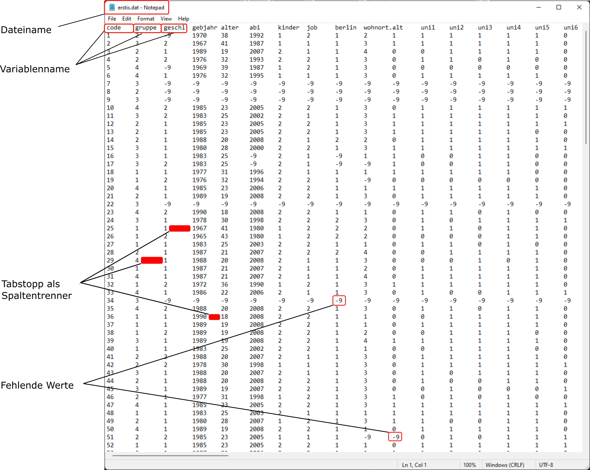
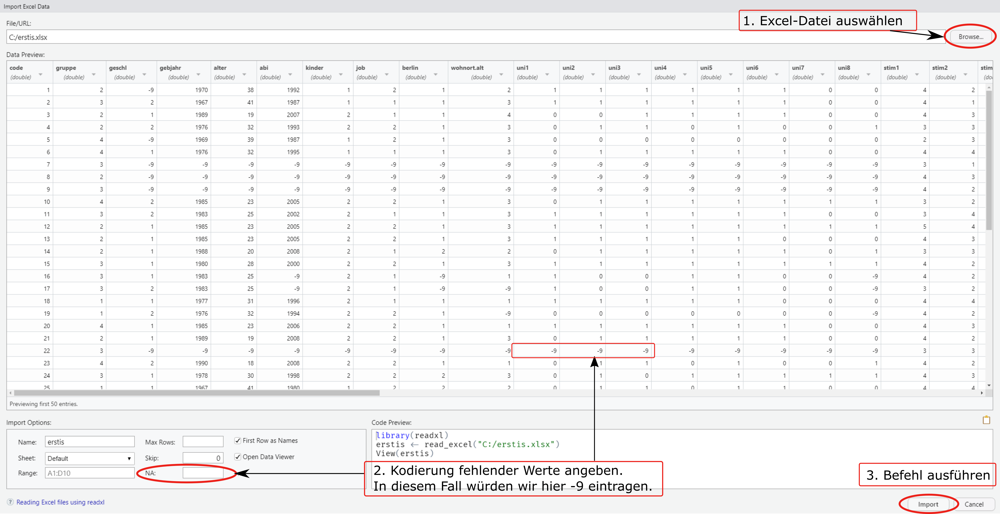

---
output:
  bookdown::pdf_document2:
    pandoc_args: '_common/header.yaml'
    includes:
      in_header: 
        - _tex/preamble.tex
header-includes:
  - \chead{Datenimport}
---

```{r, echo=F}
library(knitr)
opts_chunk$set(fig.width = 5, fig.height = 3.8, fig.align = "center", 
               comment = NA, strip.white = TRUE, 
               out.width = ".8\\textwidth",
               warning = FALSE, message = FALSE, 
               background = "springgreen3")
#knit_theme$set(knit_theme$get()[9])
options(digits = 7)
```

# Pakete

Wie im ersten Kapitel beschrieben, ist R quelloffen und kostenlos, was R in- und außerhalb der wissenschaftlichen *Community* sehr attraktiv macht. Prinzipiell kann jeder mit den nötigen Kenntnissen die Funktionalität von R erweitern und mit anderen teilen. Diese Erweiterungen werden Pakete genannt. Pakete beinhalten meist Funktionen. Sie können aber auch Objekte oder ganze Datensätze enthalten. Bei der Installation von R werden bereits eine Reihe von Paketen installiert (z.B., `base`, `stats` oder `graphics`), welche beim Start von R automatisch zur Verfügung stehen. Das gilt nur für die *R-Basispakete*; alle Pakete, die Sie manuell installieren, müssen mit jeder neuen Session auch manuell aktiviert werden. Im Folgenden lernen wir, wie R-Pakete installiert, aktiviert und deren Funktionen genutzt werden können.

### Installation von Paketen

Es gibt viele Wege, um ein Paket in R zu installieren. Die klassische Variante ist über die *Console*. Der Name des gewünschten Pakets sollte bekannt sein und auch bei den Paketnamen ist die Unterscheidung von Groß- und Kleinbuchstaben wichtig. Außerdem dürfen Paketnamen keine Leerzeichen beinhalten. Die Installation zusätzlicher Pakete sieht in allgemeiner Form so aus:

```{=tex}
\begin{center}
  \texttt{install.packages("Paketname")}
\end{center}
```
Ein praktisches Beispiel:

```{r, eval = F}
install.packages("car", dependencies = TRUE)
```

Als Erfolgsmeldung wartet man in der Konsole auf das schwarz gedruckte

`package ‘car’ successfully unpacked and MD5 sums checked`

Das Paket befindet sich nun in der sogenannten R Library des Computers und es kann darauf zugegriffen werden (s. u.). Mit dem Argument `dependecnies = TRUE` geben wir R das Recht, weitere Pakete zu installieren, die für die Benutzung des Zielpakets benötigt werden.

**Alternative 1:** RStudio bietet einen weiteren Weg zur Installation von Paketen an. Über \menu{Tools > Install Packages} öffnet sich ein Fenster, in welches lediglich der Name des Paketes eingetippt werden muss.

**Alternative 2:** Ein letzter Weg ist über den `Packages`-Reiter im Fenster unten rechts. Hier kann über den `Install`-Button dasselbe Fenster wie in *Alternative 1* aufgerufen werden. Zusätzlich erhält man eine Übersicht über alle installierten Pakete.

```{=tex}
\begin{center}
  \includegraphics[width=.5\textwidth]{img/package_installation.png}
\end{center}
```
Häufige Probleme:

-   Zu Beginn wird vom CRAN (CRAN steht für The Comprehensive R Archive Network. R sucht nach dem gewünschten Paket auf CRAN und lädt es herunter, vorausgesetzt es existiert) manchmal nach dem bevorzugten *Mirror* gefragt. Hier einfach *Germany* und eine möglichst nahe Stadt (z.B., Göttingen) auswählen, dort steht dann der Server, auf dem die Dateien liegen.
-   Pakete veranlassen oft die Installation weiterer Pakete, auf die sie angewiesen sind. Bei Versionswechseln (ca. alle 3-6 Monate) kann es sein, dass nicht alle Pakete gleich aktuell sind. Bei der Frage, ob aus neueren source-Files kompiliert werden soll, **NEIN** angeben.
-   Falls Pakete aktueller sind als die eigene R Version, wird eine meist unproblematische Warnmeldung ausgegeben: `Warnung: R Paket wurde unter R version X.Y.Z erstellt`.

### Verwendung von Paketen

Nach der erfolgreichen Installation ist ein Paket nicht automatisch in R geladen. Bevor wir also die zusätzliche Funktionalität unseres neuen Pakets nutzen können, müssen wir das Paket für uns zugänglich machen. Das geht wie folgt:

```{=tex}
\begin{center}
  \texttt{library(Paketname)}
\end{center}
```
```{r, eval=F}
library(car)
```

Nun können Sie alle Funktionen des Pakets `car` in R nutzen. Einige dieser Funktionen werden Sie im Laufe des Semesters kennenlernen.

### Aktualisieren von Paketen

Wie R werden auch Pakete mit neuen Funktionen ausgestattet oder *Bugs* behoben (Bugs\footnote{Herkunft des Wortes Bug: Das Wort Bug kommt aus dem Englischen für Insekt oder Käfer. Die Legende besagt, dass der erste Computerfehler entstand, weil eine Motte in einen Schalter geflogen ist, was beim Computer zu Fehlverhalten führte.} sind im Informatikerjargon Fehler in einem Programm, die meist durch den geschriebenen Code verursacht wurden). Aktualisieren kann man Pakete mit dem `update.packages()`-Befehl. Wenn der Befehl ohne weitere Argumente ausgeführt wird, wird für jedes Paket explizit gefragt, ob es aktualisiert werden soll. Falls man diesen Schritt überspringen will, hilft das Argument `ask`.

```{r eval=FALSE}
update.packages(ask = FALSE)  # Alle Pakete werden ohne explizite Nachfrage aktualisiert 
```

-   Achtung! Das kann abhängig von der Anzahl der installierten Pakete sehr lange dauern.

    -   Falls man nur ein bestimmtes Paket aktualiseren möchte, kann man einfach wieder mit `install.packages` arbeiten

```{r eval=FALSE}
install.packages("Paket")
```

# Arbeitsverzeichnis

-   Das Arbeitsverzeichnis (*working directory*, wd) ist der Dateiordner, auf den R standardmäßig zugreift, wenn Objekte gespeichert oder geöffnet werden sollen.
-   Die Definition des eigenen Arbeitsverzeichnisses zu Beginn jeder Sitzung verkürzt die Befehle für Einlesen, Speichern und Öffnen von Daten.
-   Wenn RStudio über Doppelklick auf ein Skript geöffnet wird, ist der Ordner, in dem das Skript liegt, das Arbeitsverzeichnis.
-   Das aktuelle Arbeitsverzeichnis kann man mithilfe der Funktion `getwd()` abfagen:

```{r, eval=F}
getwd()
```

```{r, echo=F}
"C:/Users/Icke/Documents"
```

-   Hier ist der Dateipfad des aktuellen Arbeitsverzeichnisses angezeigt, also dem Ordner (hier: Documents) mit Überordnern und Laufwerk auf den R automatisch zugreift, wenn wir Dateien öffnen oder speichern wollen.

-   Das Arbeitsverzeichnis sollte zu Beginn jeder R-Sitzung (nach jedem Öffnen des Programms) gesetzt werden. Das Arbeitsverzeichnis kann auch während einer Sitzung geändert werden.

-   Im Gegensatz zu Windows-Dateipfaden beachte man die Schreibweise mit Forward-Slash(!) als Trenner

-   Das Arbeitsverzeichnis lässt sich ändern über das RStudio Hauptmenü \menu{Session > Set Working Directory > Choose Directory ...}

    -   Dialogfenster öffnet sich
    -   zum gewünschten Ordner navigieren
    -   *Open* klicken
    -   Der Befehl `setwd("Ordnerpfad")` wird in die Console geschrieben und ausgeführt.

```{r eval=F}
setwd("X:/Pfad/zum/Ordner") 
```

Falls Sie den Befehl händisch in die Konsole eintippen möchten, vergessen Sie nicht den Ordnerpfad in Anführungszeichen zu setzen ("" oder '').

```{r eval=F}
setwd("Ordnerpfad")
getwd()
```

-   Mit `getwd()` können wir überprüfen, ob das Anlegen des Arbeitsverzeichnisses geklappt hat.

    -   Das Anlegen des Arbeitsverzeichnisses war erfolgreich, falls `getwd()` den in `setwd()` angegebenen Pfad ausgibt

-   Die Ausgabe von `setwd()` sollte aus der *Console* in das Skript kopiert werden, damit das Skript beim erneuten Öffnen weiterhin fehlerfrei läuft (falls in diesem auf Dateien aus Ordnern auf dem Computer zugegriffen wird).

# Import von Datensätzen

Wir arbeiten in den folgenden Sitzungen mit Datensätzen aus psychologischen Befragungen. Diese Daten liegen meist im Excelformat (.xlsx-Datei) oder einem Textdatenformat vor (z. B. .dat oder .txt).

Das in R verwendete Datenformat nennt sich .RData (oder abgekürzt .rda). Um Daten im RData Format speichern zu können, müssen wir sie zunächst aus den anderen Dateiformaten in R **importieren**. Wenn Daten im RData Format vorliegen, können sie hingegen einfach **geöffnet** werden.

Das korrekte Importieren ist extrem wichtig um sicherzustellen, dass man mit den richtigen Daten weiterarbeitet. Gleichzeitig ist es manchmal relativ komplex. Die gute Nachricht ist, dass man es meist nur einmal machen muss, denn danach lässt es sich einfach mit der RData Datei weiterarbeiten. Die Dateien **erstis.xlsx** (Excel-Datei) und **erstis.dat** (Textdatei) enthalten Daten von Studierenden der FU aus früheren Semestern und stammen aus dem Buch *R für Einsteiger* (Luhmann, 2015)\footnote{Luhmann, M. 2015. "R für Einsteiger. Einführung in Die Statistiksoftware für Die Sozialwissenschaften. Beltz." Weinheim, Basel.}. Das beigelegte *Codebook* gibt Aufschluss über die Variablenbenennungen und Ausprägungen.

Wir üben den Datenimport im Folgenden in zwei Varianten:

-   Einlesen einer Text-Datei über die allgemeine `read.table()`-Funktion
-   Einlesen der Excel-Datei mit Hilfe des RStudio-Menüs und Zusatzpaketen

## Datenimport von Textdateien

-   Textdatei-Formate sind universell und können in R mit der `read.table()`-Funktion importiert werden.
-   Um die Pfadangabe zu sparen, sollte das Arbeitsverzeichnis auf den Ordner gelegt werden, der den Datensatz (als Textdatei) enthält.

In der R-Hilfe für die Funktion `read.table()` finden wir u. a. folgende Voreinstellungen:

    read.table(file,  
               header = FALSE,    
               sep = "",    
               dec = ".",    
               na.strings = "NA") 

-   Diese Voreinstellungen müssen auf den Datensatz angepasst werden!
-   Bei `file` muss der Name der Textdatei (inklusive Endung) angegeben werden.
-   Mit diesem Befehl wird der Inhalt der Datendatei eingelesen. Um damit im Anschluss weiterarbeiten zu können, müssen wir den Inhalt in einem Objekt ablegen, z. B.



```{r, eval=F}
Daten <- read.table(...)
```

Die wichtigsten Parameter bei der Verwendung von `read.table` sind: `read.table(file, header, sep, dec, na.strings)`\
Diese bedeuten der Reihe nach:

1.  `file` gibt den Namen der Datei an, welche den einzulesenden Datensatz enthält. Es wird dabei im Arbeitsverzeichnis nach dieser Datei gesucht, sofern kein vollständiger Pfad (über eine URL) angegeben wird.
2.  `header` ist ein Wahrheitswert, kann also die Werte `TRUE` oder `FALSE` übergeben bekommen. Ist dieser Wert `TRUE`, so wird die erste Zeile des Datensatzes zur Benennung der Variablen verwendet. Die Angabe dieses Werts ist nicht notwendig. Wird er nicht angegeben, so wird dieser Wert per Voreinstellung auf `FALSE` gesetzt.
3.  `sep` gibt das Zeichen an, welches im jeweiligen Datensatz den Trenner zwischen dem Ende eines Wertes und dem Anfang eines anderen Wertes darstellt. Wird diese Angabe nicht gemacht, wird davon ausgegangen, dass *white space* (ein Leerzeichen) verschiedene Werte voneinander trennt.
4.  `dec` gibt das Zeichen an, welches im jeweiligen Datensatz als Dezimaltrennzeichen dient. Wird diese Angabe nicht gemacht, wird davon ausgegangen, dass der Punkt als Dezimaltrennzeichen verwendet wird.
5.  `na.strings` ermöglicht die Angabe benutzerdefinierter fehlender Werte. Per Voreinstellung werden diese mit `NA` gekennzeichnet.

\newpage
| Struktur einer `.txt`-Datei | Argumente für `read.table()`     | |
|---------------|---------------|---------------|
| Variablennamen in 1. Zeile | Nein | `header = FALSE` (default) |
| | Ja | `header = TRUE` |
|---------------|---------------|---------------|
| Spaltentrennung | Leerzeichen | `sep = ""` (default) |
| | Tabstopp | `sep = "\t"` |
| | Semikolon | `sep = ";"` |
|---------------|---------------|---------------|
| Dezimaltrennzeichen in Textdatei| Punkt | `dec = "."` (default) |
| | Komma | `dec = ","` |
|---------------|---------------|---------------|
| Kodierung fehlender Werte | `NA` | `na.strings = "NA"` (default) |
| | `-99` | `na.strings = "-99"` |
| | `-99` und `-9` | `na.strings = c("-99", "-9")` |

## Datenimport von Excel-Dateien

Für den Import von Excel-Dateien gibt es verschiedene Möglichkeiten. In RStudio hat man mit \menu{File > Import Dataset > From Excel} eine integrierte Bedienoberfläche für den Import von Excel-Dateien. Dafür muss man aber das Paket `readxl` installieren und aktivieren:

```{r eval=F}
install.packages("readxl")
library(readxl)
```



Über \keys{Browse} können die gewünschten Daten auf dem Computer lokalisiert und in die Vorschau geladen werden (Abbildung \ref{excelimp}). Falls die Vorschau die Daten richtig widerspiegelt, können, über \keys{Import}, die Daten in R importiert werden.

Ein alternatives Paket ist `gdata`, das ebenfalls für den Import von Excel-Dateien programmiert wurde. Hier fehlt die graphische Bedienoberfläche, allerdings lassen sich komplexere Datenimporte durchführen. Der Name der Funktion und die wichtigsten Parameter sind hier aufgelistet:

    read.xls(xls, 
             sheet = 1, 
             na.strings = "NA")

Diese bedeuten der Reihe nach:

1.  `xls` gibt den Namen der Datei ein, welche den einzulesenden Datensatz enthält. Es wird dabei im Arbeitsverzeichnis nach dieser Datei gesucht, sofern kein vollständiger Pfad (über eine `URL`) angegeben wird.
2.  `sheet` gibt die Nummer der Tabelle oder des Tabellen-Sheets an, welches eingelesen werden soll. Wird die Nummer nicht angegeben, so wird die erste Tabelle eingelesen.
3.  `na.strings` ermöglicht die Angabe benutzerdefinierter fehlender Werte (wie in read.table).\
    Ein Beispiel: Folgender Befehl liest die zweite Tabelle in der Excel-Datei `daten.xls` ein und speichert sie unter dem Namen `daten_excel`:

```{r eval=F}
daten_excel <- read.xls(“daten_excel “, sheet = 2, na.strings = "-9")
```

## .RData - Das R-eigene Datenformat

Wenn Objekte, die in R erstellt oder verändert wurden, im Arbeitsverzeichnis abgespeichert werden sollen, bietet sich der `save`-Befehl an.

```{=tex}
\begin{center}
  \texttt{save(Objektname, file = "Dateiname.RData")}
\end{center}
```
Der gewünschte Dateiname muss in Anführungsstrichen und mit der Dateiendung \*.RData angeben werden. Generell macht es Sinn, den Objektnamen auch als Dateinamen zu verwenden.

Um ein \*.RData-Objekt in R zu laden, benutzt man den `load`-Befehl.

```{=tex}
\begin{center}
  \texttt{load("Dateiname.RData", verbose = TRUE)}
\end{center}
```
Beispiel:

```{r eval=F}
objekt <- c(1, 3, 5)
save(objekt, file = "objekt.RData")
load("objekt.RData", verbose = TRUE)
```

Das optionale `verbose`-Argument bewirkt, dass der Objektname in die Konsole geschrieben wird.

\newpage

# Übersicht

## Neue wichtige Konzepte

-   **Pakete**
-   **Import von Daten**
-   **Arbeitsverzeichnis**

## Neue wichtige Befehle, Argumente, Operatoren

| Funktion                    | Verwendung                                        |
|-----------------------------|---------------------------------------------------|
| `install.packages("paket")` | Installiert Paket `paket` in die lokale R Library |
| `library(paket)`            | Aktiviert Paket `paket` zur Verwendung            |
| `update.packages()`         | Aktualisiert installierte Pakete                  |
| `read.table("Daten")`       | Liest eine Textdatei in R ein                     |
| `read.xls("Daten")`         | List eine Excel-Datei in R ein                    |
| `getwd()`                   | Gibt das aktuelle Arbeitsverzeichnis an           |
| `setwd("Pfad")`             | Legt den Pfad des Arbeitsverzeichnises fest       |
| `load("Daten")`             | List eine .RData in R ein                         |
| `save("Dateiname.RData")`   | Objekte aus R im Arbeitsverzeichnis speichern     |
