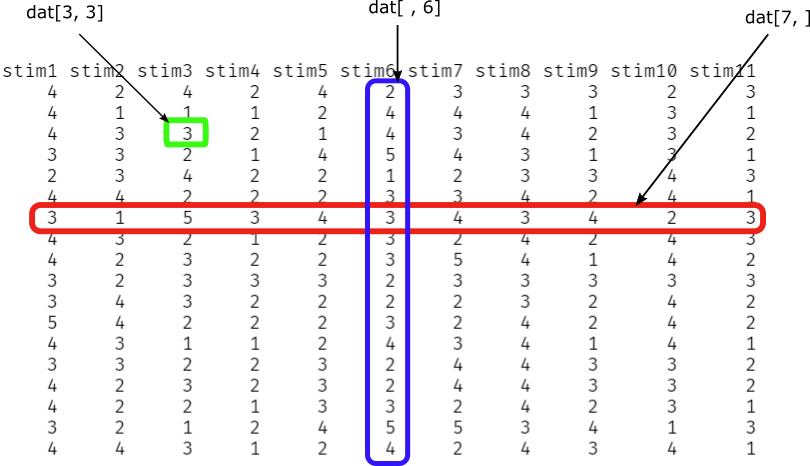

---
output:
  bookdown::pdf_document2:
    pandoc_args: '_common/header.yaml'
    includes:
      in_header: 
        - _tex/preamble.tex
header-includes:
  - \chead{Datenmanagement}
---

```{r, echo=F}
library(knitr)
opts_chunk$set(fig.width = 5, fig.height = 3.8, fig.align = "center", 
               comment = NA, strip.white = TRUE, 
               out.width = ".8\\textwidth",
               warning = FALSE, message = FALSE, 
               background = "springgreen3")
#knit_theme$set(knit_theme$get()[9])
options(digits = 7)
```

# Datenstrukturen

## Vektoren und Data Frames

Sie haben bereits eine Datenstruktur in Form eines Vektors kennengelernt. Ein Vektor ist nichts anderes als die Zusammenfassung von Zahlen in ein Objekt. 

```{r}
vektor <- c(2, 3, 5)
vektor
```

Eine *mächtigere* Datenstruktur ist der sogenannte **Data Frame**. Im Gegensatz zum Vektor ist der Data Frame 2-D (zweidimensional); er besteht aus benannten Zeilen und Spalten. Normalerweise tritt ein Datensatz in der Psychologie in einer tabellen-ähnlichen Form auf, wobei unterschiedliche Spalten für unterschiedliche Variablen und unterschiedliche Zeilen für unterschiedliche Personen stehen. Der Data Frame kann diese Art von Daten durch seine Zweidimensionalität genau abbilden.

Beispiel:
```{r echo=F}
setwd(this.path::here())  # set wd in source file location
```

```{r}
load("dat/erstis.RData")    # laden von Daten
```
  - zuerst laden wir den in `erstis.RData` gespeicherten Data Frame in R
```{r eval=F}
str(erstis)
```
  - mit dem `str()`-Befehl (kurz für *Structure*) kann man sich die (Daten-)Struktur eines Objekts vollständig angeben lassen
  - je nach Größe des Objekts, für das man sich die Struktur ausgeben lassen will, kann das Ergebnis in der Konsole sehr viele Zeilen einnehmen (deshalb werden hier nur Ausschnitte des Outputs gezeigt)
  
Für Data Frames kann man den `str`-Befehl in zwei Bestandteile unterteilen. 

\begin{center}
  \includegraphics[width=.5\textwidth]{img/str-1.png}
\end{center}

  - `data.frame` beschreibt die Datenstruktur des Objekts `erstis`.
  - das Objekt `erstis` ist also ein Data Frame mit 191 Beobachtungen (Zeilen) und 55 Variablen (Spalten)

\begin{center}
  \includegraphics[width=.5\textwidth]{img/str-2.png}
\end{center}

  - die Dollarzeichen leiten eine neue Spalte im Data Frame `erstis` ein, d.h., dass `alter` eine Variable (Spalte) im Data Frame `erstis` darstellt
  - es hilft, sich Data Frames als eine Anreihung gleichlanger Vektoren vorzustellen. Jeder dieser Vektoren entspricht genau einer Variable (Spalte)
  - die Abkürzung `int` steht für `integer` (Ganze Zahlen) und beschreibt den Datentyp (s.u.) der dazugehörigen Variable
  - `alter` ist also eine Variable, die die Datenstruktur Vektor hat und nur ganze Zahlen beinhalten darf
  - als letztes werden die ersten 10 Elemente angezeigt
  
Wenn man auf eine Variable in einem Data Frame zugreifen will, dann kann man das mit dem $-Operator. 

```{r}
erstis$alter
```

Der $-Operator wird zwischen den Namen des Data Frames und den Variablennamen gesetzt. In allgemeiner Form:

\begin{center}
  \texttt{dataframe\$variable}
\end{center}  

Falls man sich nur für die Datenstruktur eines Objekts interessiert, ohne sich den zusätzlichen Output des `str`-Befehls ausgeben lassen zu müssen, kann man den `class`-Befehl benutzen.
  
```{r}
class(erstis)
```

# Datentypen

Neben den *Integers* gibt es noch eine Reihe anderer Datentypen:

  - Numerische Vektoren (*numeric* oder *integer*) enthalten nur
Zahlen
    + *numeric*: i.d.R. Dezimalzahlen/ *integer*: i.d.R. ganze Zahlen 
    + In dieser Veranstaltung wird nicht weiter zwischen *numeric* und *integer* unterschieden, wir bezeichnen beide Vektoren als *numeric*
  - Zeichenvektoren (*characters*) werden als Text behandelt
(Buchstaben, Wörter, Zeichen, auch Zahlen als Text)
  - Faktoren (*factors*) werden als kategoriale (nominalskalierte) Variablen behandelt (dazu später mehr)

Um einen Zeichenvektor zu erstellen kann wieder der `c`-Befehl benutzt werden. Dafür muss jedes Element des Vektors bei der Erstellung in Anführungszeichen gesetzt werden:
```{r}
planeten <- c("Merkur", "Venus", "Erde", "Mars", "Jupiter", "Saturn", "Uranus", "Neptun")
planeten
```

```{r}
class(planeten)
```
Hier gibt der `class`-Befehl für `planeten` die Datenstruktur `character` aus.  Dies ist die englische Bezeichnung für Vektoren, die Zeichen beinhalten.  
Auf Vektoren können eine Reihe von Funktionen angewendet werden. Die `length`-Funktion gibt die Anzahl der Elemente eines Vektors wieder.

```{r}
length(planeten)                       # 8 Planeten in unserem Sonnensystem
```

Vorsicht! Es gibt Funktionen, die nur auf bestimmte Datentypen angewendet werden können.
```{r eval=F}
sum(planeten)
```
\textcolor{red}{\texttt{Error in sum(planeten) : invalid 'type' (character) of argument}}

Hier wird der `sum`-Funktion ein Zeichenvektor übergeben, um die Summe aus allen Elementen des Vektors zu bilden. R gibt einen Fehler aus, da R, logischerweise, nicht weiß wie Zeichen summiert werden.

## Erstellen eines Data Frames

Wie Vektoren kann man auch Data Frames in R selbst erzeugen.  Hierfür wird, analog zum `c()`-Befehl, der `data.frame()`-Befehl verwendet. 

Beispiel:
```{r}
planeten <- c("Merkur", "Venus", "Erde", "Mars", "Jupiter", "Saturn", "Uranus", "Neptun")
planetentyp <- c("Erdplanet", "Erdplanet", "Erdplanet", "Erdplanet", "Gasplanet", 
                 "Gasplanet", "Gasplanet", "Gasplanet")

sonnensystem <- data.frame(planeten, planetentyp)
sonnensystem
```

  - Zuerst wurden zwei Zeichenvektoren erstellt. Dem `data.frame()`-Befehl wurden als Argument die Vektoren `planeten` und `planetentyp` übergeben. Der erstellte Data Frame wird schlussendlich im Objekt `sonnensystem` abgelegt. 
  - Im Output kann man sehen, dass die Spalten des Data Frames den Vektoren entsprechen, und zwar in der Reihenfolge, in der die Vektoren an den `data.frame`-Befehl übergeben wurden. 
    + Grundsätzlich gilt: Alle Spalten müssen in einem Data Frame dieselbe Länge haben!

```{r eval=F}
id <- c(1, 2, 3, 4, 5, 6, 7) # Vektor mit sieben Elementen
data.frame(planeten, id)     # Sonnensystem hat acht Planeten! -> FEHLER
```

\textcolor{red}{\texttt{Error in data.frame(planeten, id) : arguments imply differing number of rows: 8, 7}}

Man kann einen erstellten Data Frame auch durch neue Vektoren (also Spalten) erweitern oder enthaltene Informationen löschen.

*Hinzufügen von Vektorem zu einem Data Frame:*
```{r}
sonnensystem$monde <- c(0, 0, 1, 2, 69, 62, 27, 14)
sonnensystem
```

  - Ein numerischer Vektor wird erzeugt und mit dem Zuweisungspfeil `<-` im Data Frame `sonnensystem` als neue Spalte `monde` abgespeichert

*Löschen von Vektoren (Spalten) in einem Data Frame:*
```{r}
sonnensystem$monde <- NULL
sonnensystem
```

  - Dem Vektor `monde` im Data Frame `sonnensystem` wurde der Wert `NULL` zugewiesen. Das führt dazu, dass der Vektor `monde` gelöscht wird.
  
# Datenkontrolle

Da auf Basis der Daten Berechnungen angestellt und Schlüsse gezogen werden, ist es sehr wichtig, die Daten auf ihre Richtigkeit zu kontrollieren! Fehler können beispielsweise beim Datenimport ...

  - falsches Dezimaltrennzeichen
  - fehlende Werte nicht berücksichtigt

... oder bei der Dateneingabe auftreten:

  - Werte liegen außerhalb des möglichen Wertebereichs
  - Werte liegen innerhalb des möglichen Wertebereichs
    + nur identifizierbar über doppelte Dateneingabe
   
Um Fehler beim Datenimport identifizieren zu können, kann man den `str`-Befehl nutzen. So kann man beispielsweise überprüfen, ob numerische Variablen auch numerische Vektoren sind oder ob der Datensatz alle Personen abbildet, die man beispielsweise einen Fragebogen ausfüllen lassen hat.  
Um Werte außerhalb des zulässigen Wertebereichs zu identifizieren, kann man den `summary`-Befehl verwenden. Mit diesem Befehl lassen sich Verteilungskennwerte über die Variablen des Datensatzes ausgeben.

# Datenüberblick

Der Unterschied zu `str()` ist, dass der der `summary`-Befehl nicht die Datenstruktur, sondern eine Zusammenfassung des Objektinhalts ausgibt. 

Beispiel:
```{r eval=F}
summary(erstis)
```

\begin{center}
  \includegraphics[width=.5\textwidth]{img/summary_output.png}
\end{center}

  - die Darstellung unterscheidet sich nicht nur im Inhalt zum `str()`-Befehl, sondern auch im Format der Ausgabe
  - die Variablen werden nun im Spaltenformat ausgegeben
    + für jeden numerischen Vektor im Datensatz werden das Minimum, Maximum, das erste und dritte Quartil, sowie der Median und das arithmetische Mittel ausgegeben
    + falls die Variable fehlende Werte beinhaltet, werden die fehlenden Werte für diese Variable gezählt und in `NA` angezeigt
    
Weitere nützliche Befehle für die erste Erstellung eines Datenüberlicks:

```{r eval=F}
nrow(erstis)      # Anzahl der Zeilen
ncol(erstis)      # Anzahl der Spalten
names(erstis)     # Spaltennamen
colnames(erstis)  # Spaltennamen
rownames(erstis)  # Zeilennamen
na.omit(erstis)   # Ausschluss ALLER Personen/Zeilen, die mind. einen fehlenden Wert aufweisen
```

# Indexierung

R bietet eine Vielzahl an Tools an, um einen Datensatz zu bearbeiten oder auf einen Teil des Datensatzes zuzugreifen.

## Indexierung: Vektoren

Um bestimmte Zellen innerhalb eines Vektors anzusprechen, benötigen wir eine Funktion zur Indexierung. In R werden dafür die eckigen Klammern (`[]`) verwendet. So können einzelne Elemente eines Vektors ganz einfach über die Position innerhalb des Vektors ausgewählt werden.

```{r}
vektor <- c(2, 3, 5)
vektor[2]
```

Das geht auch mit Zeichenvektoren oder Vektoren mit Wahrheitswerten:

```{r}
character_vector <- c("P", "S", "Y", "C", "H", "O", "L", "O", "G", "I", "E")
character_vector[6]

bool_vector <- c(TRUE, FALSE)
bool_vector[2]
```

## Indexierung: Data Frames

Im Gegensatz zu Vektoren sind Data Frames zweidimensional. Wenn also nur auf ein bestimmtes Element des Datensatzes zugegriffen werden soll, muss eine Zeile **und** eine Spalte spezifiziert werden. 

\begin{center}
  \texttt{dataframe[Position: ZEILE , Position: SPALTE]}
\end{center}  

Zeilen und Spalten werden durch ein Komma getrennt! (s. auch Abbildung \ref{datstruc})

Beispiel:
```{r}
erstis[2, 4]
```

  - in der 2. Zeile der 4. Spalte des Data Frames `erstis` ist die Zahl 1967 abgespeichert
    + daraus folgt, dass die 2. Person des Datensatzes im Jahr 1967 geboren wurde, da die 4. Spalte der Variable `gebjahr` entspricht
    
Es ist auch möglich ganze Zeilen oder Spalten auszugeben. 

```{r eval=F}
erstis$gebjahr              # Indexierung mit $-Operator (ohne "")
erstis[, "gebjahr"]         # Indexierung mit []; Spalte über Namen spezifiziert (mit "")
```
```{r}
erstis[, 4]                 # Indexierung mit []; Spalte über Position spezifiziert
```
  
  - alle Befehle führen zur Ausgabe der Spalte `gebjahr` inkl. aller dazugehörigen Zeilen
    + das Freilassen des Zeilen- oder Spaltenelements bedeutet, dass alle Zeilen, respektive Spalten, ausgewählt werden
    
Wenn man sich mehrere Spalten oder Zeilen ausgeben lassen möchte, dann geht das mit der Übergabe von Vektoren:
```{r}
erstis[2, c(2, 3, 4)]
```

  - hier wurde die 2. Zeile der 2., 3. und 4. Spalte ausgewählt
    + in diesem Fall ist es möglich `2:4` anstatt `c(2, 3, 4)` zu übergeben, da die ausgewählten Spalten (`2,3,4`) aufeinander folgen
  - allerdings ist `c()` notwendig für die Indexierung, falls a) separate Spalten ausgewählt werden sollen oder b) mehrere Spalten über ihre Namen ausgewählt werden sollen:

```{r}
erstis[2, c(2, 4)]
```

  

  
### Indexierung mit Logischen Operatoren

Eine nützliche Form der Indexierung ist die Benutzung von logischen Operatoren. 

```{r}
erstis[erstis$alter < 20, "alter"]
```

Es lohnt sich diesen Befehl etwas genauer zu betrachten:

  - Mit `erstis$alter` greifen wir auf die Spalte `alter` im Data Frame `erstis` zu
    + Nun wird `erstis$alter` mit dem logischen Operator `<` verknüpft. Wir filtern mit `erstis$alter < 20` alle Werte aus der Spalte `alter`, die kleiner als 20 sind
  - Dies wird nun an den Data Frame, in der **Zeilenposition**, übergeben
    + Es sollen also nur die Personenzeilen des Data Frames `erstis` ausgegeben werden, die in der Spalte `alter` Werte kleiner 20 haben
  - In der **Spaltenposition** wird die Spalte `alter` spezifiziert
  - Der Data Frame wurde also nicht nur auf bestimmte Personen (alter < 20), sondern auch auf die Spalte `alter` gefiltert
  
Mit logischen Operatoren lassen sich sehr komplexe Filterprozesse konstruieren:

```{r}
erstis[erstis$alter < 20 & !is.na(erstis$alter), "alter"]
```

  - Der obige Befehl wurde um `!is.na(erstis$alter)` erweitert
    + `is.na()` schaut sich jeden Wert in der Spalte `alter` an und gibt ein `TRUE` aus, falls der Wert `NA` (Not Available) sein sollte
    + `!` kehrt alle Wahrheitswerte um. `TRUE -> FALSE` oder `FALSE -> TRUE`
  - Das `&`-Zeichen verbindet die beiden Operationen. 
  - Mit dieser Befehlskette werden zusätzlich (zum Filtern der unter 20-jährigen) alle fehlenden Werte (`NAs`) aus dem Datensatz `erstis` gefiltert

# Faktoren

Variablen mit Ordinalskalenniveau oder höherem Skalenniveau werden in R als Vektoren angelegt. Variablen mit Nominalskalenniveau werden in R hingegen als Faktoren gespeichert. Ein Faktor ist damit der Datentyp einer Variable, deren Ausprägungen diskrete, ungeordnete Kategorien sind. Die Abspeicherung einer Variable im jeweils richtigen Datentyp hat wichtige Konsequenzen für ihre Weiterverarbeitung in R. So können bestimmte Analysen nur für bestimmte Datentypen durchgeführt werden. 

Die Umwandlung eines Vektors in einen Faktor bzw. die Erstellung eines Faktors kann man mit der Funktion factor() vornehmen: 

```{r}
num <- c(1, 0, 0, 1)
factor_num <- factor(num)

str(factor_num)
```

Mit `str()` lassen wir uns erneut die Struktur des Faktors `factor_num` ausgeben. Der Output gibt uns die Datenstruktur des Objekts `factor_num` aus. Zusätzlich erhalten wir die Anzahl der `levels` des Faktors, also die Anzahl der Kategorien sowie die Kategorienamen. Wie auch bei anderen Datenstrukturen werden nach dem Doppelpunkt die ersten Elemente des Objekts ausgegeben. Vielleicht ist es Ihnen aufgefallen, dass die Elemente nicht den `levels` entsprechen. Das liegt daran, dass R intern die *echten* Werte numerisch abspeichert. Bei Zeichenvektoren kann der Befehl genauso angewendet werden:

```{r}
char <- c("F", "M", "M", "F")
factor_char <- factor(char)

str(factor_char)
```

Der `factor()`-Befehl wandelt also numerische Variablen (Zahlen) und Zeichenvektoren in kategoriale Variablen um. Auch hier werden die Elemente als Zahlen dargestellt! Die wichtigsten Argumente bei Verwendung dieses Befehls sind:  
`factor(x, levels, labels = levels)`  
Diese Argumente bedeuten der Reihe nach:

  1. `x` gibt den Namen des Objekts an, welcher umgewandelt werden soll.
  2. `levels` zeigt an, welche Zahlenwerte die kategoriale Variable grundsätzlich annehmen kann. Wird diese Angabe nicht gemacht, so werden die Zahlenwerte übernommen, welche in den übergebenen Daten vorhanden sind.
  3. `labels` ermöglicht die Benennung der Kategorien der kategorialen Variable. Die Benennung entspricht der Reihenfolge der Werte in `levels`. Die Namen werden in einer runden Klammer übergeben, vor welcher ein **c** steht. 

Wir betrachten als Beispiel die Variable Geschlecht. Da Geschlecht als dichotome (nominalskalierte) Variable erhoben wurde, würde sich für diese die Umwandlung in einen Faktor anbieten. Durch die Kodierung als Faktor, teilen wir R mit, welche Eigenschaften diese Variable hat und welche Operationen mit dieser Variable sinnvoll sind. In R lassen sich einige Funktionen nur auf Objekte eines bestimmten Datentyps anwenden. Nutzen wir nun den `factor()`-Befehl auf unseren `erstis` Datensatz an:

```{r}
str(erstis$geschl)
```

  - beim Datenimport werden Variablen, welche nur Zahlen enthalten per Voreinstellung als numerische Vektoren abgelegt
  - Wir wandeln die Variable `geschl` daher nun in einen Faktor um:

```{r}
erstis$geschl <- factor(erstis$geschl,
                       levels = c(1, 2),
                       labels = c("weiblich", "männlich"))
str(erstis$geschl)
```

  - bei der Umwandlung in einen Faktor ist es wichtig, dass die Reihenfolge der Werte in `levels` zu den Kategorienbezeichnungen in den `labels` passen
    + dafür muss das *Codebook* zurate gezogen werden und unter der Variable *Geschlecht* die Zuweisung der Ausprägungen gelesen werden. Erst dann ist es möglich, die `labels` den `levels` korrekt zuzuordnen
  - die neue Variable (die Faktorform von `erstis$geschl`) wurde dem Namen der Ausgangsvariable zugewiesen. Die Ausgangsvariable wurde also überschrieben und ist in R nicht mehr zugänglich

Die Beschriftung der Faktorstufen kann abgefragt werden mit dem `levels()`-Befehl:

```{r}
levels(erstis$geschl)
```

# Umkodierung von Variablen

Es gibt mehrere Gründe, warum Variablen umkodiert werden:

  - Umpolen von negativ formulierten Items einer Skala
  - Zusammenfassen von Kategorien einer Variablen
  - Fehlende Werte sind mit einer bestimmten Zahl kodiert und sollen durch NA ersetzt werden. (Falls dies beim Einlesen nicht berücksichtigt wurde.)

Im `erstis` Datensatz wurde die Stimmung der Probanden anhand mehrerer Fragen erhoben (sogenannter *Items*). Um einzelne Variablen (Items einer Skala) umzupolen, muss jede mögliche Ausprägung dieser Variable ausgewählt und dann neu zugewiesen werden. Bei der Veränderung von Werten in einer Variable macht es Sinn die veränderten Werte in einer neuen Variable abzuspeichern. Diese neue Variable erhält im folgenden die Endung `_r` für rekodiert.

```{r}
erstis$stim4_r[erstis$stim4 == 1] <- 5
erstis$stim4_r[erstis$stim4 == 2] <- 4
erstis$stim4_r[erstis$stim4 == 3] <- 3
erstis$stim4_r[erstis$stim4 == 4] <- 2
erstis$stim4_r[erstis$stim4 == 5] <- 1
```

Einfacher mit `recode()`-Befehl aus dem Paket `car`:

```{r}
library(car)
erstis$stim4_r <- recode(erstis$stim4, recodes = "1=5; 2=4; 3=3; 4=2; 5=1")
erstis$stim11_r <- recode(erstis$stim11, recodes = "1=5; 2=4; 3=3; 4=2; 5=1")
```

  - Hier wird mit einer Zeile dasselbe ausgeführt wie oben in fünf Zeilen
    + mit dem `recodes`-Argument wird die Umkodiervorschrift angegeben
    + die Umkodiervorschrift wird in Anführungszeichen eingeschlossen und Wertepaare durch Semikola getrennt

# Rechnen mit Skalenwerten

Um beispielsweise einen Skalenmittelwert zu berechnen, kann man den `rowMeans()`-Befehl verwenden. Ein Skalenmittelwert wird errechnet, indem man die Werte aller Items einer Skala für eine Person mittelt. Mit dem `rowMeans()`-Befehl lässt sich das ganz einfach für alle Personen im Datensatz durchführen, das heißt zeilenweise.

```{r}
set_gs <- c("stim1", "stim4_r", "stim8", "stim11_r")         # Speichern der Itemnamen
erstis$gs1 <- rowMeans(erstis[, set_gs], 
                      na.rm = FALSE)
```

- Wir übergeben der `rowMeans()`-Funktion all diejenigen Spalten des Datensatzes `erstis`, welche die Werte der Items der Skala gute vs. schlechte Stimmung enthalten. Dies sind die Items `stim1` (zufrieden), `stim4` (schlecht), `stim8` (gut) und `stim11` (unwohl). Die Items `stim4` und `stim11` müssen zuvor umgepolt werden (s.o.), damit hohe Werte für alle Items die gleiche Bedeutung haben (hoher Wert = positivere Stimmung).

- Das Objekt `set_gs` enthält die Namen der entsprechenden Variablen
- über `erstis[, set_gs]` übergeben wir der `rowMeans()`-Funktion die Spalten des Datensatzes `erstis` mit diesen vier Variablen
- Die Funktion berechnet dann zeilenweise (d.h., für jede Person) den Mittelwert über die vier Werte der Person auf diesen Items
- Das Ergebnis wird in einer neuen Variablen (neue Spalte) namens `gs1` gespeichert und dem Datensatz hinzugefügt
- Umgang mit fehlenden Werten: bei der Berechnung des Skalenmittelwerts stellt sich die Frage, ob für Personen mit fehlenden Werten ein Skalenmittelwert berechnet werden soll
    + `na.rm = FALSE` impliziert einen strengen Umgang mit fehlenden Werten: Personen, die mindestens einen fehlenden Wert aufweisen (d.h., auf mindestens einer der zu mittelnden Variablen) erhalten keinen Skalenmittelwert, sondern den Wert `NA` auf der neuen Variablen `gs1`. 
    + ein liberaler Umgang mit fehlenden Werten ist mit `na.rm = TRUE` möglich. Hier wird jede Person, die mindestens einen gültigen Wert aufweist, mit in die Berechnung aufgenommen. Die Person erhält auf der Variable `gs1` den Mittelwert über alle für sie vorhandenen Werte auf den vier Items.

# Typische Schritte beim Umgang mit neuen Daten

  - Variablennamen festlegen
  - Daten eingeben oder einlesen
  - Fehlende Werte kodieren
  - Kategoriale Variablen kodieren
  - Plausibilität prüfen
  
    + Gibt es Eingabefehler? Werte, die es nicht geben kann?
    + Sind fehlende Werte richtig kodiert?
    + Gibt es unmögliche Werte (z.B., durch Tippfehler)?
  
  - Items invertieren, also Kodierung inverser Fragebogen-Items umkehren
  - Neue Variablen berechnen
  
    + Summenscores/Mittelwerte für Skalen aus mehreren Items
    + Zeitdauer aus Anfangszeit/Endzeit
    + Alter aus Geburtsjahr
    + ...

\newpage
# Übersicht

## Neue wichtige Konzepte

  - **Datenstrukturen**
  - **Datentypen** 
  - **Datenüberblick**
  - **Datenkontrolle**
  - **Indexierung**
  - **Faktoren**
  
## Neue wichtige Befehle, Argumente, Operatoren

Funktion                     | Verwendung
-----------------------------|--------------------------------------------------------------
`Datensatz[a, b]`            | Auswahl einer oder mehrerer Zeilen (a) und einer oder mehrerer Spalten (b)
`objekt$element`             | Auswahl/Ansprache von einem Element in einem Objekt
`objekt$element <- NULL`     | Löschen von Element (z.B. einer Variable) in Objekt (z.B. einem Datensatz) 
`str(Objekt)`                | Abfrage der Objektstruktur 
`summary(Objekt)`            | Zusammenfassung der Objektinhalte
`length(Objekt)`             | Länge eines Objekts (Anzahl der Elemente)
`nrow(Datensatz)`            | Anzahl von Personen (Zeilen)
`ncol(Datensatz)`            | Anzahl von Variablen (Spalten)
`names(Datensatz)`           | Abfrage der Variablennamen
`na.omit(Datensatz)`         | Entfernt alle Fälle mit mind. einem fehlendem Wert
`is.na(x)`                   | Logische Abfrage: Ist der Wert x fehlend?
`factor(x)`                  | Wandelt x in einen Faktor um
`levels(x)`                  | Zeigt die Faktorstufen des Faktors x an
`recode(x, "Vorschrift")`    | Erstellt eine nach der Umkodiervorschrift veränderte Variante von x
`rowMeans(x)`                | Berechnet die Zeilenmittelwerte

\newpage
# Appendix

## Funktionen

### `lapply`

R stellt eine Reihe an nützlichen Funktionen als Teil des R-Basispakets `base` zur Verfügung. Im folgenden schauen wir uns `lapply` an. 
Mit `lapply` kann ein Befehl (Funktion), den man an `lapply` übergibt, auf eine beliebige Anzahl an Objekten in nur einer Zeile Code angewendet werden. Das wird am Beispiel der nun bekannten Umkodierung von Items demonstriert:
```{r}
set_2do <- c("stim4", "stim11")
```
- Namen der **zu umkodierenden** Items werden einem Objekt `set_2do` als Zeichenvektor zugewiesen
```{r}
set_new <- c("stim4_r", "stim11_r")
```
- Namen der **umkodierten** Items werden einem Objekt `set_new` als Zeichenvektor zugewiesen
```{r}
erstis[, set_new] <- lapply(erstis[, set_2do], 
                            FUN = recode, 
                            recodes = "1=5; 2=4; 3=3; 4=2; 5=1")
```
- mit `lapply` werden alle Items des Objekts `set_2do` gleichzeitig und nach **derselben** Umkodiervorschrift umgepolt!
- das erste Argument entspricht dem Objekt, bzw. den Items, die wir umpolen wollen
  + in unserem Fall sind das die Spalten des `erstis`-Datensatzes
  + daher indexieren wir den `erstis`-Datensatz mithilfe dem von uns erstellten Objekt `set_2do`. Denn das enthält die Itemnamen.
- das Argument `FUN` entspricht der Funktion, die wir auf die einzelnen Items anwenden wollen
  + in unserem Fall benutzen die Funktion `recode``
- das letzte Argument ist eigentlich ein Argument der Funktion `recode` und nicht der Funktion `lapply`!
- falls also weitere Argumente der Funktion, die wir auf das Objekt anwenden wollen (in unserem Fall `recode`), übergeben werden sollen, müssen diese an `lapply` übergeben werden (nicht an `recode`!). 
Kodieren Sie die Items einmal mit und einmal ohne `lapply` und vergleich Sie das Ergebnis. Wenn Sie Umkodierung richtig vorgenommen haben, sind die umkodierten Spalten/Items identisch. 


